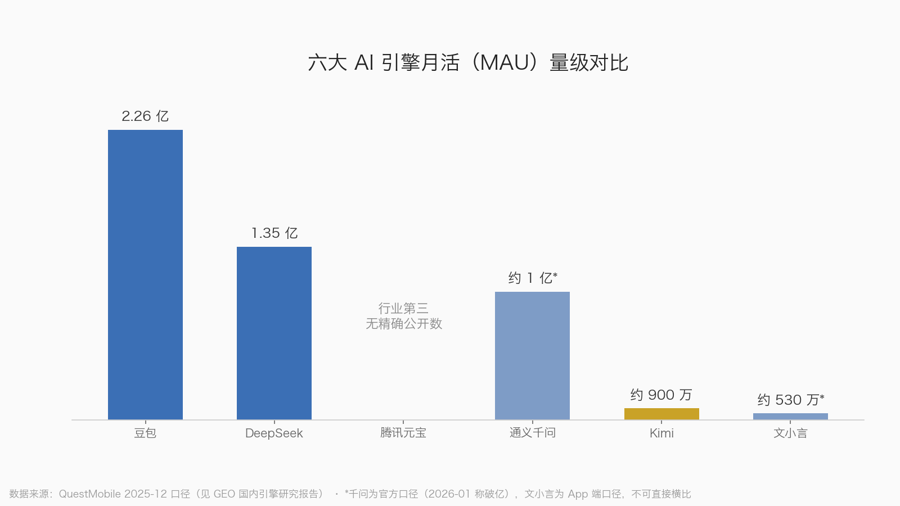

# 第5章 GEO 登场：生成式引擎优化是什么

## 5.1 先讲一个你每天都在经历的场景

打开豆包或者 DeepSeek，输入"5000 块预算买什么降噪耳机"。十秒钟后，一段回答出现在屏幕上：两三款耳机的名字、各自的优缺点、一句"如果你主要通勤用，选 A；如果追求音质，选 B"。

你关掉 App，直接去下单了。

注意，整个过程里你没有看到任何一条蓝色链接，没有翻到第二页，没有点开任何一个品牌的官网。你没有"搜索"，你进行了一次"咨询"。而在这场咨询里，被点名的品牌赢了，没被点名的品牌——哪怕它 SEO 做得再好、常年挂在百度第一位——连出场的机会都没有。

这就是 GEO 要解决的问题。本章回答四件事：GEO 这个概念从哪来、它和 SEO 到底差在哪、为什么现在的 AI 引擎是一个"没有广告位的商场"、以及这门生意现在的真实规模。

## 5.2 GEO 的出处：一个比 ChatGPT 还年轻的概念

GEO，Generative Engine Optimization，生成式引擎优化。这个词不是营销公司拍脑袋造出来的，它有明确的学术出处：2023 年 11 月，来自普林斯顿大学、佐治亚理工学院等机构的研究者在 arXiv 上发表了一篇论文，标题就叫《GEO: Generative Engine Optimization》，后来这篇论文被数据挖掘领域的顶级会议 KDD 2024 正式收录。

这篇论文干了一件很实在的事：研究者们搭建了一套评测框架，系统地测试"什么样的内容更容易被生成式引擎（当时主要是各类带联网能力的 AI 问答系统）在回答中引用和推荐"。结论可以浓缩成一句话——**能被 AI 看上的内容有规律可循，而且这个规律和搜索引擎那套不一样**。比如，在内容中嵌入清晰的引用来源、具体的统计数据、权威的引述，能显著提高内容在 AI 回答中的可见度，论文报告的提升幅度最高可达约四成。

论文提出的方法论细节我们会在第 6 章展开。这里你只需要记住：GEO 从诞生第一天起，研究对象就不是"排名"，而是"引用"——AI 在生成答案时，挑谁的话来说、把谁的名字写进答案里。

我用一句话定义这本书里的 GEO：

> **GEO 是通过优化内容的结构、可信度和分发位置，让 AI 引擎在回答用户问题时引用你、推荐你、替你说好话的一系列方法。**

## 5.3 核心比喻：SEO 是抢货架，GEO 是搞定导购员

整本书我们用一个比喻贯穿始终，你先把它吃透，后面所有章节都是它的展开。

**传统搜索是一家超市。** 搜索结果页就是货架：第一页是进门最显眼的端架，第二页是中间的排面，第三页以后是仓库。SEO 的全部学问，是怎么把自己家的商品摆上端架——交得起"租金"（竞价排名）的直接买位，交不起的就研究超市的陈列规则（算法），靠优化包装、堆头、促销牌（标题、外链、关键词）挤上去。用户从货架上拿起商品（点击），走到收银台（落地页），成交。

**AI 引擎不是超市，是带导购员的精品店。** 店里没有货架。顾客进门说"我要买个降噪耳机，5000 预算"，导购员想了想，直接从后场拿出两三款，告诉你哪款适合你。顾客大概率听导购员的，拿了就走。

注意这个场景里的几个关键事实：

第一，**导购员不收摊位费，没有货架租金这回事。** 你想塞钱让她优先推荐你的货？目前没这个门——这一点 5.5 节会详细讲，截至 2026 年初，国内六家主流 AI 引擎都没有官方的 AI 回答广告产品。

第二，**导购员只信"她自己读过的可信材料"。** 她的推荐话术不是凭空来的，是她平时读的杂志、看的测评、听同行聊出来的口碑，在她脑子里沉淀成的判断。你想让她推荐你，唯一的办法是：提前出现在她读的那些材料里，并且写得让她觉得可信、好用、值得转述。

第三，**导购员的推荐就是成交本身。** 超市里顾客还要自己走完"看到—拿起—比价—结账"的流程，导购员场景里，她一句话说完，顾客的决策就结束了。没有中间环节给你拦截。

所以 GEO 的本质动作就一句话：**不去抢货架，去研究导购员的阅读清单，然后把自己写进她信得过的那几页里。**

## 5.4 GEO 与 SEO 的本质区别

光说"排名 vs 引用"太抽象。我们把区别拆成三层，每一层都对应一个打法上的根本转变。

### 第一层：排名 vs 引用——位置是固定的，话术是活的

SEO 的世界里，位置是稀缺而稳定的：第一名就是第一名，全天 24 小时挂在那里，谁搜都一样。GEO 的世界里没有"位置"，只有"这一次的答案"。同一个问题，AI 今天引用了你，明天可能引用别人；换个问法，答案整个重写。你争的不是一个格子，而是导购员每一次开口时"想起谁"。

这里有一个我们在研究中反复确认、每个做 GEO 的人都该刻在脑子里的数字：鲸牙启量对国内引擎近万道题的样本统计显示，**AI 回答的整体引用覆盖率只有 50.4%——将近一半的回答，一个引用来源都不给**。换句话说，导购员每推荐两次，就有一次完全不报出处。在这种环境下，"能被点名、能被标注出处"本身就是稀缺卡位，比传统搜索的第一名稀缺得多。

### 第二层：点击 vs 被说出——流量漏斗变成了信任漏斗

SEO 的度量是点击：曝光、点击率、落地页转化，一条漏斗。GEO 的度量是"被说出"：AI 有没有提你、怎么描述你、把你和哪些对手放在一起比。很多情况下用户根本不点击——答案看完，决策做完，你的网站流量统计里什么都不剩，但这单生意已经成了或者丢了。

这带来一个反直觉的结论：**GEO 时代，"零点击的胜利"是真实存在的胜利。** 用户在 AI 里问"聚水潭和旺店通哪个好"，AI 给出一张对比表并引用了你写的测评，用户直接去买了——你的官网 UV 没有任何变化，但你赢了。还在盯着流量报表做 GEO 的团队，等于用体温计量体重。

### 第三层：爬虫 vs 信源网络——一只蜘蛛变成了一桌杂志

搜索引擎的抓取逻辑是"爬虫"：一只蜘蛛顺着链接爬全网，你把自家网站优化好（收录、权重、结构），基本盘就在。AI 引擎不是这么干活的。它生成答案时依赖的是一张"信源网络"——模型训练读过的语料，加上联网检索时抓到的内容，而**每家引擎抓哪、信哪，偏好完全不同**。

我们针对国内六家引擎的信源研究显示，这种偏好的差异大到可以直接决定打法：

| 引擎 | 导购员的"读物偏好" | GEO 实质动作 |
|---|---|---|
| 豆包 | 字节系：今日头条、抖音、西瓜视频 | 头条号 + 抖音号内容矩阵 |
| 腾讯元宝 | 微信公众号（约占其信源的一成，单一渠道占比最高）、视频号 | 公众号矩阵——**没有公众号内容的品牌在这里几乎拿不到曝光** |
| 文心一言 | 百家号、百度百科、百度知道，与百度搜索收录深度绑定 | SEO 与 GEO 高度协同，最"稳"的平台 |
| DeepSeek | 无自有生态，靠开放网页：搜狐、网易、百科、行业媒体 | 多平台铺同口径内容，提高被抓取概率 |
| Kimi | 外采为主，但企业官网/品牌页权重高（引用覆盖率约 67.6%，六家最高之一） | 官网事实页 + 媒体报道 + 目录一致性 |
| 千问 | 权威媒体集中、知识文档 | 权威媒体铺稿 + 官方白皮书 |

看出来了吗？**六家引擎就是六个阅读习惯完全不同的导购员**：豆包这个导购爱刷抖音和头条，元宝这个导购是公众号重度订阅者，DeepSeek 这个导购习惯翻门户新闻和百科。你在公众号里写得天花乱坠，对豆包的影响约等于零——那本杂志它根本不订。

这对 SEO 老兵是最大的思维冲击：过去优化好一个网站就能通吃所有搜索引擎的日子结束了。GEO 的分发是"一鱼多吃"——同一份事实，要改造成知乎问答版、公众号长文版、门户新闻版，分别喂给不同的导购员。具体怎么改造，是第 7 章和第 8 章的内容。

最后，把三层区别收进一张总表：

| 维度 | SEO | GEO |
|---|---|---|
| 争夺对象 | 搜索结果页的排名位置 | AI 答案里的引用与表述 |
| 用户动作 | 点击链接，进入你的网站 | 读完答案，直接决策 |
| 抓取逻辑 | 爬虫 + 单一站点权重 | 信源网络 + 跨平台分布 |
| 效果度量 | 排名、点击率、UV | 被引用率、品牌描述倾向、对比中的站位 |
| 内容形态 | 围绕关键词的网页 | 结论前置、可验证、结构化的"可引用件" |
| 生效范围 | 优化好一个站，通吃各家搜索 | 每家引擎一套信源打法，各做各的 |

## 5.5 一个没有广告位的商场，以及商场里已经开始抓小广告了

先说现状。截至 2026 年初，我们逐一核对过：豆包、DeepSeek、Kimi、通义千问、文心一言、腾讯元宝，**六家主流 AI 引擎均无官方的 AI 回答广告产品**。腾讯甚至公开承诺过元宝不嵌入商业结果。这意味着今天你在任何 AI 回答里看到的品牌推荐，全部是有机内容影响的结果——没有一条是买来的。

回到导购员比喻：**这是一家导购员目前不收红包、也不许挂广告牌的店。**

这个现状有两层含义。第一层是机会：流量采买的钞能力暂时失效了。过去预算充足的大品牌可以直接买断端架，小品牌再努力也只能排队；现在所有品牌回到同一条起跑线，比的是谁的内容更可信、更对导购员的胃口。内容能力第一次压过了预算能力。

第二层是警醒：没有广告位，就有人动歪脑筋。市面上已经长出了 GEO 灰产——批量生成低质 AIGC 软文，全网铺量，赌 AI 抓取时撞上概率。翻译成比喻：导购员不收红包，那就往她的杂志堆里塞小传单，塞得够多，总能混进她的视野。

平台已经在动手了。DeepSeek 官方在 2025 年 5 月接受澎湃新闻采访时明确表示，正在对低质 AIGC 铺稿内容进行识别和降权。其他家跟进只是时间问题——逻辑很简单，导购员一旦被发现推荐话术是靠小传单喂出来的，这家店的口碑就完了，平台比谁都急。

所以这本书从第一章就立规矩：**铺低质软文是一条正在收窄的死路，真实、带数据、可验证的内容才是长期资产。** 灰产赚的是平台打击落地前的时间差，而时间差这门生意，从来长不大。

## 5.6 这个市场到底有多大

最后算账。先看用户侧，导购员的生意有多好：

- 知乎研究院 2025 年 Q2 的一份千余人调研显示，**83% 的用户过去三个月用 AI 了解过消费品信息，55% 的消费者认为 AI 推荐会影响自己的决策**；同一调研里，AI 搜索的满意度（3.95）已经超过了传统搜索（3.62）。
- HCR 慧辰 2025 年 5 月的调研更直接：**92% 的消费者在购物决策中使用过 AI 辅助**。
- 引擎侧的量级也立住了：以 QuestMobile 2025 年 12 月口径，豆包月活约 2.26 亿，DeepSeek 约 1.35 亿，腾讯元宝增速最快。

> 图 1：六大国产 AI 引擎月活量级对比。豆包、DeepSeek 为 QuestMobile 2025-12 口径；千问为官方口径（2026-01 称破亿）；文小言为 App 端口径；元宝无精确公开数，行业排位第三。各口径不可直接横比。

再看生意侧。头豹研究院估测，**2025 年国内 GEO 市场规模约 21 亿元，到 2027 年预计达到 242 亿元**——两年十倍。

这个数要注明口径：它统计的是围绕 GEO 的服务与工具市场（代运营、内容生产、监测 SaaS 等），是"卖铲子"的钱，不是 AI 渠道本身撬动的交易额。21 亿的绝对值放在整个数字营销大盘里还很小，但曲线的斜率说明方向：这相当于一个刚开张的新商场，客流（用户问 AI 的比例）在猛涨，铺位（被 AI 引用的位置）还没开始收租，先进场的人免费用着端架。

历史总是押韵的。2003 年前后做 SEO 的人、2013 年前后做微信公众号的人、2018 年前后做抖音的人，享受的都是同一种红利：平台规则成熟之前的那几年，认真做事的人用很低的成本拿走了未来很贵的东西。GEO 现在就站在这个时间点上。

> **本章小结**
>
> - GEO（生成式引擎优化）出自 2023 年 11 月的同名论文（后被 KDD 2024 收录），研究对象是"如何被 AI 在答案中引用"，而非搜索排名。
> - 核心比喻：SEO 是抢超市货架位置，GEO 是影响导购员的推荐话术。导购员没有货架租金可收，只信自己读过的可信材料——GEO 的全部工作就是写进那几页材料里。
> - 三层本质区别：排名 vs 引用、点击 vs 被说出、单一爬虫 vs 各不相同的信源网络。引用覆盖率仅约 50.4%，"能被 AI 点名"本身就是稀缺卡位。
> - 截至 2026 年初，国内六家主流引擎均无官方 AI 回答广告产品，钞能力暂时失效；同时 DeepSeek 已明确对低质 AIGC 铺稿降权，灰产的时间差生意长不大。
> - 市场处于爆发早期：头豹估测国内 GEO 服务市场 2025 年约 21 亿元、2027 年预计 242 亿元（服务与工具口径）。现在进场，成本最低。
