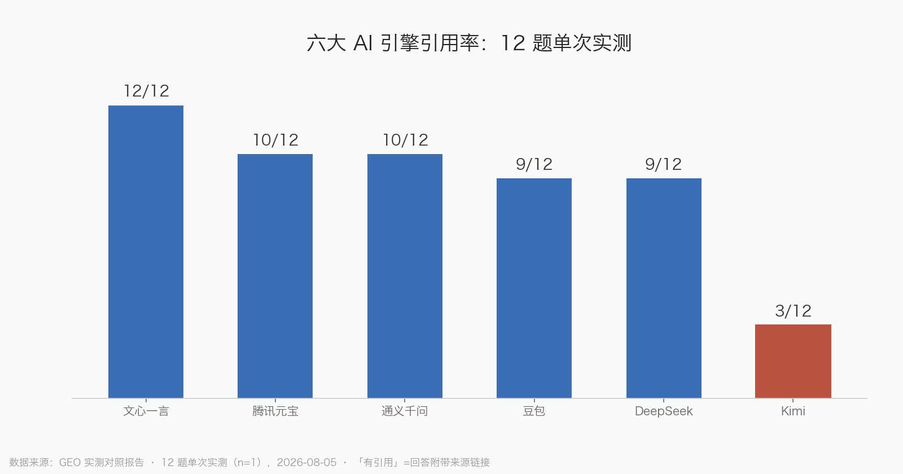
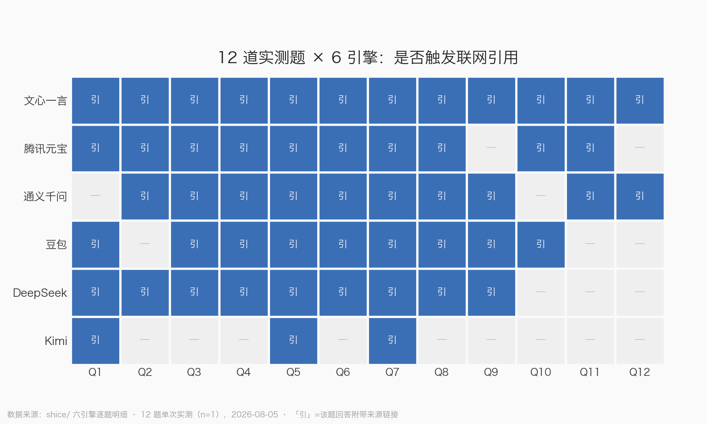
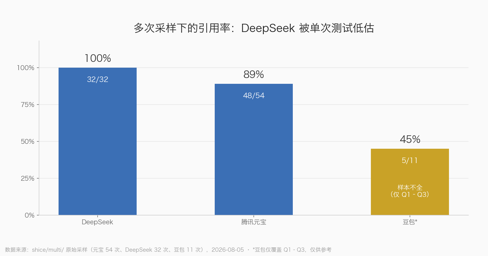

# 第6章 实测：六大国产 AI 引擎引用行为

前面几章讲的都是推断和方法，这一章上硬菜：我们把六大国产 AI 引擎——豆包、DeepSeek、腾讯元宝、通义千问、文心一言、Kimi——拉进同一个考场，用同一套 12 道题逐个问过去，把它们的引用记录一条条扒下来对账。

为什么要自己做这件事？因为市面上关于"AI 引擎爱引用什么"的说法，大多是从搜索语料反推的——就像你想知道一家餐馆用什么食材，不去后厨看，而是去翻它扔在门口的垃圾袋。翻垃圾袋能猜个大概，但只有实测才知道：豆包到底有多偏爱抖音视频，元宝是不是真的被公众号"包养"，Kimi 是不是压根不联网。实测做完，我们发现有些推断对了，有些错得离谱——比如知乎，这个被无数 GEO 文章捧上神坛的渠道，在我们的实测引用里几乎查无此人。

这一章是全书的"数据发动机"：后面的渠道优先级、内容形态选择，都以这里的数据为准。

## 实验设计：先讲清楚我们是怎么测的

### 12 道题怎么选的

题目不是拍脑袋来的，而是从前面 prompt 研究阶段筛出来的真实用户查询，覆盖两个行业（广告电商、教育培训）和五种典型的提问动机：

- **对比题**：Q1"晓多跟乐言比店小蜜哪个好用"——用户在 AI 面前做购买决策；
- **症状题**：Q2"千川计划跑不动应该加价还是暂停计划"、Q3"全域推广一直消耗不出单怎么办"——带着具体问题来求医问药；
- **方法题**：Q4"怎么用 DeepSeek 和剪映批量做带货短视频"——要一套可执行流程；
- **信任题**：Q5"短视频带货训练营是真的吗"、Q6"抖音小店无货源是割韭菜吗"、Q9、Q10——用户在求一个"要不要信、要不要花钱"的判断；
- **选型/私域题**：Q7"小鹅通太贵了有什么平替"、Q8"老师批改作文用什么 AI 工具"、Q11/Q12（教培私域转化）——这是中小商家最关心的钱袋子问题。

这五种动机，基本就是商家做 GEO 要争夺的全部入口。选 12 题而不是 100 题，是因为我们要逐题人工核对引用来源——题目越少，每一题看得越细。这好比查账：抽查 12 笔流水逐笔对到原始凭证，比扫一眼 1000 笔的总数有用得多。

### 为什么每题必须开一个新对话

实测方式是 WebBridge 控制真实浏览器逐题提问，**每题都在一个全新的独立对话里提问，逐字提问、不改写**。

这条纪律是为了防"串味"。AI 对话有上下文记忆：如果你先问了"晓多跟乐言比店小蜜哪个好用"，再在同一会话里问"千川跑不动怎么办"，第二题的答案和引用可能被第一题的上下文带偏——就像面试官面完一个侃侃而谈的候选人，接着面下一个时手里还拿着上一份简历，评分就不干净了。开新对话等于每面一个人都换一块干净白板，保证每道题的引用行为都是该引擎对这个问题的"第一反应"，而不是被聊嗨了之后的样子。

顺带一个执行细节：千问的匿名额度只够 4~5 个对话，Q5 之后的题是登录后补测完成的。这也提醒我们，不同平台的测试成本不一样，做长期监测时要把登录态、额度这些限制算进去。

### 引用率的口径与局限：n=1 是什么，多次采样又是什么

先说口径。我们说的"引用率"，指**一道题的回答里是否带出了可提取的外部引用来源**：12 题里有几题带引用，就是"几/12"。DeepSeek 的引用来自回答内嵌的引文链接，元宝来自"源"面板的引用卡片，千问要从接口里回抓来源数据，文心更麻烦——页面不渲染链接，我们只能按回答末尾"参考资料"列表里标注的站名提取。

再说局限，这一节请每个想引用本书数据的读者认真看。

**单次测试是 n=1**。AI 回答有随机性，同一道题今天问和明天问，引用可能不一样。n=1 的结论就像你去相亲角只站了一个下午，回来就说"这个市场全是属狗的"——样本量撑不起统计结论。所以单次测试的所有数字，我们只敢当**方向性信号**用：哪家引得多、哪家几乎不引、信源大致是什么构成，这些结论是稳的；但"引用率 75% 和 83% 谁高谁低"这种比较，别当真。

**多次采样才是统计口径**。我们后来补做了一轮：每题问 4~5 次，看引用行为的稳定性。这就像外卖评分——一条好评可能是刷的，连续五十条评价里四十三条提到"分量足"，那才是这家店的真实属性。多次采样总共落盘 97 条有效采样后被迫中止（原因见本章末尾的风控复盘），但它修正了三个单次测试的结论，后面会专门讲。

一句话总结：**本书引用行为结论按"方向性"使用，不按"统计显著"使用。**谁要是拿我们的 9/12 去写"某某引擎引用率 75%"的精确报告，那是他不懂抽样，不是我们的数据有问题。

## 六引擎逐个画像

给每个引擎一个拟人化比喻，方便你记住它们的脾气。GEO 的实操说白了就是"见人下菜碟"——先认清人，再决定上什么菜。

### 文心一言：逢问必查的图书管理员

文心是六家里唯一 **12/12 题全部带引用**的，每题甩出 21~33 条参考资料，全书实测总共 321 条，来源含百度系（爱企查、百度百科、word.baidu、百家号）、新闻门户，以及——大量你听都没听过的小号："糖汐兮""猫猫""好物品质分享全保障"这类。

它像个强迫症晚期的图书管理员：你随便问一句"中午吃啥"，他都要抱一摞书过来，从《中国饮食文化史》到小区门口打印店复印的传单，全部摊在你面前，每张都标好出处。查得勤是优点，不挑就是缺点了——长尾小自媒体极多，噪音大。

**GEO 含义**：文心的引用门槛是六家里最低的，低权重小号内容也有机会被引。**铺量策略在文心最有效**——百家号、搜狐号发起来，别管账号权重多高。

### 腾讯元宝：在业主群里翻聊天记录的热心邻居

元宝 12 题中 10 题有引用，去重域名 71 个，但信源构成极度偏科：**mp.weixin.qq.com（公众号）出现 48 次，约占全部引用的三分之一**。

它像小区里那个消息最灵通的热心邻居：你问什么他都答得上来，但细一打听，情报八成来自他天天泡着的几个业主微信群。公众号就是元宝的业主群。

**GEO 含义**：做元宝，就是做公众号。B 端私域类问题（Q11 引了 15 条，公众号占多数）在元宝上的被引机制几乎全走公众号，这类内容优先发公众号长文，而不是知乎。

### 豆包：只逛自家超市的导购

豆包 9/12 题有引用，信源构成把"字节系"三个字写在脸上：**抖音视频（iesdouyin.com）出现在 9 题，今日头条 7 题**，其后才是 CSDN（5 题）、博客园（3 题）。

它像超市自有品牌专区的导购：你问什么他都推荐，但领你逛的永远是自家货架——抖音视频、头条文章，偶尔才去隔壁货架拿一瓶 CSDN。实测比我们此前的推断还极端。

**GEO 含义**：针对豆包的内容，形态上要靠**抖音视频和头条文章**，图文问答铺得再好也够不着它的引用区。另外注意，豆包的引用不在页面渲染成链接，是内嵌角标加底部参考列表——用户看得见来源名，但点不点得着是另一回事。

### DeepSeek：查完才开口的执业律师

DeepSeek 单次测试 9/12 有引用（Q10、Q11、Q12 未触发联网）。它的信源是六家里最"杂而正"的：新闻媒体（澎湃、央广、人民网）、投诉/政务源（黑猫投诉、地方 315、各地政府网）、品牌官网（小鹅通 sem 页、晓多博客）三管齐下。信任类问题上，它是唯一成体系引用黑猫投诉和地方 315 的。

它像执业律师：开口之前先查卷宗，而且专挑有法律效力的证据——官方文件、投诉记录、权威媒体报道，营销号软文基本进不了它的证据链。

**GEO 含义**：品牌自有内容阵地能被它直接引用（晓多官方博客、小鹅通官方 sem 页都进了它的引用列表）；评估类内容挂上投诉/政务数据，在 DeepSeek 这里特别吃得开。

### 通义千问：跑遍全城菜市场的采购员

千问 10/12 有引用，**去重域名 53 个，引用面是六家里最广的**：新闻媒体（新华网、澎湃、中新网）、百度系（百度百科、mbd.baidu）、机构官网（edu.iflytek.com、ai.youdao.com、xiaoe-tech.com）、政务站（scjgj.beijing.gov.cn）、技术社区、以及 11467 黄页、神马聚合页这类低质长尾，一锅端。

它像给大食堂采购的老师傅：天不亮出门，批发市场的正经摊位要逛，犄角旮旯的游击队小摊也不放过，最后拉回来一三轮车菜——有有机蔬菜，也有来路不明的散装货。胜在全，输在杂。

**GEO 含义**：千问是唯一同时高频吃新闻媒体、教育机构官网和政务站的引擎，机构类品牌（教育 SaaS、官方平台）在千问上的机会独一份；但低质黄页也能进引用，说明它的门槛同样不高。

### Kimi：凭记忆答题的学霸

Kimi 是最扎心的一家：**12 题里只有 3 题有引用**，其余 9 题纯模型作答、不联网。少数几次联网，引的也多是 CSDN、搜狐这类内容农场。

它像班里那个过目不忘的学霸：你问他题，他基本不翻书，张口就答——答案常常还像模像样（Q8 的品牌推荐名单给得挺全），但全凭脑子里的存货。问题是，他的记忆停留在训练数据截止那天，你的新内容根本不在他脑子里。

**GEO 含义**：3/12 的引用率意味着大部分回答完全由模型参数生成，**外链内容很难影响 Kimi 的回答**；叠加其 MAU 萎缩的趋势，Kimi 的 GEO 投入优先级应排在六家最后。prompts 清单里 target_engines 含 kimi 的行，建议整体降半档。

## 引用率总表

| 引擎 | 单次引用率 | 多次采样引用率 | 头号信源 | 一句话脾气 |
|---|---|---|---|---|
| 文心一言 | 12/12 | 未测（预计差异不大） | 百度系 + 海量长尾小号 | 量大但质杂，门槛最低 |
| 腾讯元宝 | 10/12 | **89%**（48/54） | 公众号（约占 1/3） | 公众号包养户 |
| 千问 | 10/12 | 未测 | 新闻媒体 + 机构官网 | 引用面最广 |
| DeepSeek | 9/12 | **100%**（32/32） | 媒体 + 投诉/政务 + 官网 | 被单次测试低估 |
| 豆包 | 9/12 | 45%（5/11，样本不全） | 抖音视频 + 今日头条 | 字节系自留地 |
| Kimi | 3/12 | 未测 | 内容农场（少量） | 基本不联网 |

> 图 1：六引擎 12 题单次实测的引用率。12 题单次实测（n=1），2026-08-05；"有引用"指回答附带来源链接。单次数据只作方向性信号使用。

> 图 2：引用行为的逐题明细。12 题 × 6 引擎单次实测（n=1），2026-08-05；"引"表示该题回答附带来源链接。注意 Q11/Q12（B 端私域题）只有元宝和文心有引用，Q9 在元宝和 Kimi 上无引用。

第一梯队按修正后结论排：**文心、元宝、DeepSeek、千问**，四家都是高引用引擎；豆包看题目类型；Kimi 垫底。

## 多次采样带来的三个修正

单次测试是相亲角站一个下午，多次采样是跟踪随访三个月。随访做完，三个"初诊结论"被推翻了。

> 图 3：多次采样口径下的引用率（2026-08-05）。DeepSeek 32/32 全部联网引用、元宝 48/54（89%）；豆包仅完成 Q1–Q3 共 11 次采样，样本不全，仅供参考。

### 修正一：DeepSeek 被严重低估

单次测试 DeepSeek 是 9/12，我们一度把它放在第二梯队。多次采样打完脸：**开启"智能搜索"后 32 次提问全部联网引用，100%**（覆盖 Q1~Q6 各 5 次、Q7 两次）。单次的 9/12 只是部分题恰好没触发联网开关。

DeepSeek 的高频信源也在这轮看清了：新浪系 13 次、百度系 10 次、抖音电商学习中心 9 次、华声在线 9 次、四川在线 8 次、博客园 7 次、飞书云文档 6 次。两个信号值得单独记：官方学习中心（school.jinritemai.com）被反复引用，**行业 SOP 文档放在飞书云文档（bytedance.larkoffice.com）上也能被 DeepSeek 和千问引到**——这是一个此前没有任何报告提过的内容形态。

### 修正二：元宝的公众号主导，成立

54 次采样里 **48 次有引用（89%），其中 43 次含 mp.weixin.qq.com**——约八成采样带公众号，单次测试"公众号占三分之一"的判断在更大样本下站住了。但也更立体了：今日头条出现 33 次、腾讯新闻 new.qq.com 16 次，元宝的口粮比单次测试显示的更多元，不是只吃公众号一口奶。另外 Q9（AI 辅导作业）5/5 全部无引用——这题在元宝上是稳定的"纯模型作答"题，再多次采样也撬不动。

### 修正三：豆包的症状题，真的不联网

Q2"千川跑不动"在单次测试里无引用，我们怀疑是偶然。多次采样 **0/4，稳定无引用**，而 Q1 对比题 4/5 有引用。结论坐实：**症状型口语问题在豆包上倾向纯模型作答**。做这类题的内容卡位，对豆包价值有限——你想让它在"千川跑不动"里引用你，就像往一个不看说明书的用户手里塞说明书，塞了也不看。

## DeepSeek 风控事件：一次代价不小的踩坑

多次采样原计划每题 5 次 × 5 引擎。执行到一半，停了。

过程是这样的：我们用自动化方式对 DeepSeek 连续提问，**大约 30 次连续提问后，平台判定违规、触发风控**。考虑到账号安全，整个多次采样计划就此中止——这就是为什么多次采样数据停留在 97 条，元宝做得最全（54 次），DeepSeek 做到一半（32 次），豆包只有 3 题，千问和文心完全没做。

教训有三条，想长期监测品牌 AI 可见度的读者直接抄作业：

1. **平台不是爬虫的沙包**。高频自动化提问一定会触发风控，这和爬搜索引擎被 ban 是同一个道理，只是 AI 平台的风控更直接——它本来就是给人一句一句聊的。
2. **自建监测必须限速**。分钟级间隔、每日提问上限，一个都不能少。单次测试那种"一下午问完 12 题"的强度是安全的，但把同样的强度乘以采样次数，就越线了。
3. **认真考虑现成工具**。如果你的需求是持续监测（而不是一次性摸底），GEOBase、新榜智汇这类监测工具的存在意义就在于此——自建抓取的隐性成本（账号风险、维护成本、被封后的数据断档）往往高于订阅费。

这次踩坑也反过来印证了本章开头的方法论：正因为 AI 回答有随机性、平台有风控，引用行为研究才永远是"方向性结论 + 定期复核"，而不是一份测完管三年的报告。

最后交代一个诚实的尾巴：本次实测在测试账号的各平台留下了每题一个的正式对话记录。这提醒我们，实测用的是真实账号、真实会话，数据带着真实现场的毛边——也正因为如此，它比任何模拟环境里的推断都更接近你的客户真实看到的东西。

> **本章小结**
>
> - 12 道实测题覆盖对比、症状、方法、信任、选型五种动机，每题独立新对话防止上下文污染，逐字提问不改写。
> - 单次测试是 n=1，只能当方向性信号；多次采样（97 条有效采样）才是统计口径，二者不能混着用。
> - 六引擎脾气分明：文心量大质杂门槛最低，元宝被公众号"包养"，豆包只吃字节系，DeepSeek 证据链最正，千问引用面最广，Kimi 基本不联网、GEO 优先级垫底。
> - 多次采样修正了三件事：DeepSeek 真实引用率是 100% 应入第一梯队；元宝 80% 采样含公众号、判断成立；豆包症状题稳定不联网、别白费力气。
> - 高频自动化提问约 30 次就触发 DeepSeek 风控——长期监测要么限速，要么用现成工具。
