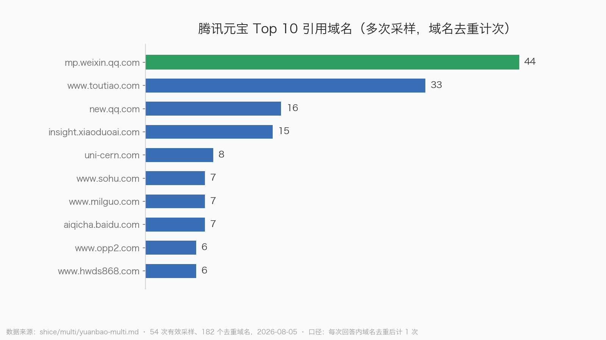
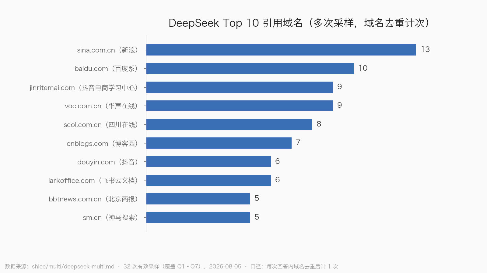

# 第7章 信源地图：内容铺在哪里才会被 AI 看见

第 6 章讲了内容该"长成什么样"，这一章解决同样重要的另一半问题：内容该"发在哪儿"。

先给你一个必须记住的底色数据。鲸牙启量对 9786 道题的样本统计显示，AI 回答的整体引用覆盖率只有 50.4%——将近一半的回答没有任何引用，完全是模型凭"记忆"作答。这意味着什么？意味着**能被引用的内容本身就是稀缺卡位**。你的内容只要进入了引用池，就已经赢过一半的答案；而能不能进引用池，七分看渠道，三分看内容。

但渠道这件事，远比"全网铺一遍"复杂。因为每家 AI 引擎背后站着不同的母公司，吃不同的"供应链"。这一章我们用一个比喻贯穿始终，再把我实测踩出来的坑——包括一次结结实实的认错——全部摊开给你看。

## 一、生态绑定定律：各家 AI 都有自己的"食堂供应商体系"

把每家 AI 引擎想象成一家大公司的食堂。员工（用户）来吃饭，菜从哪儿来？字节、腾讯、百度这种自家有农场、有中央厨房的公司，食堂当然优先采购自家供应链的菜——倒不一定是行政命令，而是自家菜最新鲜、拿货最方便、品控最熟。久而久之，外部供应商想进这家食堂，门槛就越来越高。

这不是比喻，是实测结论。2026 年 8 月，我们用真实浏览器对六家国产引擎逐题实测了 12 个问题（每题独立新对话、逐字提问不改写），结果生态绑定的强烈程度超出了此前的研究推断：

- **豆包的字节供应链**：12 题里，9 题引用了抖音视频（iesdouyin），7 题引用了今日头条。你发在知乎上的万字长文，在豆包这里的权重远不如一条讲清楚同一个问题的抖音短视频。
- **元宝的腾讯供应链**：单次实测中公众号文章被引用了 48 次，约占其全部引用的三分之一。后来我们做了 54 次多次采样，43 次（约 80%）都引用了 mp.weixin.qq.com。可以下结论：**没有公众号内容的品牌，在元宝上几乎不存在**。多次采样还显示今日头条（33 次）、腾讯新闻（16 次）也是元宝的重要信源。
- **文心的百度供应链**：12 题全部有引用，每题引 21 到 33 篇，总共 321 条，百家号、百度百科、爱企查、word.baidu 高频出现。

> 图 1：元宝多次采样（54 次有效采样，2026-08-05）的 Top 10 引用域名，按"每次回答内域名去重"口径计次。公众号（mp.weixin.qq.com）以 44 次居首，今日头条、腾讯新闻分列其后——腾讯系自有内容构成元宝的信源基本盘。

文心这里有个反直觉的细节值得单独说。它引用量最大，但"质最杂"——大量无名小号（类似"糖汐兮""好物品质分享"这种名字的账号）也在被引。这说明**文心的引用门槛是六家里最低的，低权重小号内容也有机会**。所以别家的策略是"做精"，文心这里"铺量"居然真的有效——百家号矩阵式发文，是六家里投入产出比最直接的一档。

> **生态绑定定律**：有内容生态的引擎（豆包、元宝、文心），优先引用自家生态内容；你想影响它，先进它的供应链。

## 二、没有自家食堂的三家：DeepSeek、Kimi、千问吃什么

DeepSeek、Kimi、千问这三家，母公司要么没有 C 端内容生态，要么生态不绑定。它们像三家没有食堂的公司，行政只能每天出去采购——去门户网站、百科、官网、权威媒体这些"公共菜市场"买菜。对做 GEO 的人来说，这反而是好消息：**公共菜市场谁都能摆摊，不看户口**。

但三家的采购口味差别很大：

**DeepSeek：杂而正的"挑剔采购员"。** 单次实测它只有 9/12 题联网引用，我们一度低估了它；后来多次采样（受平台风控所限只完成 32 次）发现，开启"智能搜索"后 32/32 全部联网引用——它的引用率被单次测试严重低估，应列入第一梯队。它的高频信源是：新浪系（13 次）、百度系（10 次）、抖音电商学习中心（9 次）、华声在线（9 次）、四川在线（8 次）、博客园（7 次）、飞书云文档（6 次）。新闻门户 + 百科 + 官方文档 + 投诉政务源，信源结构是六家里最"杂而正"的。

> 图 2：DeepSeek 多次采样（32 次有效采样，覆盖 Q1–Q7，2026-08-05）的 Top 10 引用域名，按"每次回答内域名去重"口径计次。新闻门户、百度系、官方学习中心与飞书云文档构成其主力信源。

**千问：采购清单最长的行政。** 10/12 题有引用，去重域名多达 53 个，是引用面最广的一家——新华网、澎湃、中新网等权威媒体，百度系内容，讯飞、有道、小鹅通这类机构官网，甚至政务站（如北京市监局）都在引。但注意，它的长尾里也有 11467 黄页、神马聚合页这类低质源。千问的打法对应是：权威媒体铺稿 + 官方文档/白皮书，铺得越正越稳。

**Kimi：基本可以排在最后。** 12 题只有 3 题有引用，9 题纯模型作答，有引用也多是 CSDN、搜狐这类内容农场。它的引用覆盖率里官网权重确实高（研究口径 67.6%，六家最高之一），但 3/12 的引用率意味着外链内容很难影响它的回答，加上 MAU 萎缩（约 900 万且持续走低），**投入优先级应排在六家最后**——做好官网事实页顺手覆盖即可，不必专门投入。

## 三、"知乎修正"：这本书里最重要的一次认错

现在讲一个我们自己的翻车案例，它比前面所有结论都值钱。

在做前期研究时，我们基于搜索语料推断：**知乎是当前被 AI 引用最多的 UGC 形态，是 GEO 的主阵地**。这个推断在当时看起来有理有据——知乎内容结构化、问答形态天然匹配、在传统搜索里权重高。我们甚至据此写进了内容落点建议。

然后实测给了我们一巴掌。

12 题 × 6 引擎跑下来，**知乎几乎只在文心的引用里零星出现，豆包、DeepSeek、元宝、Kimi 的引用里基本看不到知乎**。真正被高频引用的是：CSDN、博客园、搜狐、网易、今日头条、公众号，外加少量的什么值得买。

为什么推断会错？因为我们犯了一个 GEO 新手最容易犯的错：**把"传统搜索里的权重"当成了"AI 引用里的权重"**。这两个池子高度重叠但不是同一个东西——百度搜索给知乎的权重，不等于豆包的检索系统能抓到或愿意抓知乎。各家引擎的实时检索有自己的抓取范围、合作协议和反爬现实，这些数据外人看不到，唯一可靠的办法就是实测。

这个修正直接改变执行层面的渠道优先级。举个具体例子：B 端私域类问题（比如"培训机构怎么做招生获客"），实测中豆包、DeepSeek、Kimi 全部纯模型作答不联网，只有元宝引了 15 条（公众号为主）和文心有引用。如果按"知乎主阵地"的旧判断，你会把这类内容发知乎——结果就是零引用。按修正后的判断，**这类内容应该优先发公众号和百家号**。

所以这一章我只强调一句话：凡是本书给出渠道结论的地方，我们都标注了它是"推断"还是"实测"。你在外面看到的任何 GEO 渠道建议，也请用同一个标准审视——**没有实测数据背书的渠道结论，都按假设处理**。

## 四、三个意外发现：没人告诉过你的信源

实测最有价值的产出，往往是那些你本来没想找的东西。这次有三个：

**1. 飞书云文档会被引用。** 在千川投放类问题上，飞书云文档（bytedance.larkoffice.com）出现在了 DeepSeek 和千问的引用里，DeepSeek 多次采样中 larkoffice 域名出现了 6 次。这意味着行业 SOP、实操手册这类内容，**做成公开的飞书文档也是一种可被捕捞的形态**——很多团队的内部文档本来就在飞书上，设为"互联网可见"几乎零成本。

**2. 品牌官方博客能直接进引用。** 客服机器人对比题里，晓多的官方博客 insight.xiaoduoai.com 同时出现在豆包、元宝、DeepSeek 三家的引用里；小鹅通的官方 SEM 页也被 DeepSeek 引用。这证实了第 6 章的核心主张：**自建结构化问答库会被直接引用**。官网不是"门面"，是可以被 AI 当教材用的信源。

**3. 抖音电商学习中心被反复引用。** school.jinritemai.com 在千川类问题上被豆包和 DeepSeek 反复引用，DeepSeek 采样里出现 9 次。平台官方的教学内容，在 AI 眼里是垂直领域的"标准教材"。对应策略：你所在行业的**官方学习中心、帮助中心、学院类站点，是天然的引用高地**，值得优先争取露出，或者干脆自己建一个。

另外补充一个不算意外但被验证的点：信任评估类问题（"XX 靠谱吗""是不是割韭菜"），DeepSeek 会引黑猫投诉、地方 315，文心会引各地市监局官网。评估类内容挂上政务和投诉数据，引用概率明显更高。

## 五、信源选择决策树：你的内容该先发哪里

铺垫完了，上决策树。用的时候从上往下走，走到叶子就是动作。

**第一步：你的目标用户主要在哪个 AI 上提问？** 先定主攻引擎，再谈渠道。大众消费者偏豆包/DeepSeek，微信场景重的行业（教育、B 端服务）必须覆盖元宝，搜索习惯强的中老年和下沉用户绕不开文心。

**第二步：主攻引擎有没有自家生态？**

- **豆包** → 头条号 + 抖音号内容矩阵。注意一个实测细节：症状型口语问题（"千川跑不动怎么办"）在豆包多次采样中 0/4 无引用，纯模型作答——这类内容想卡位豆包，**必须做成抖音视频或头条文章，图文问答形态没用**；对比类问题（4/5 有引用）则可以图文。
- **元宝** → 公众号长文是入场券，没有就先注册再说话。视频号、腾讯新闻源可作补充。
- **文心** → 百家号 + 百度百科词条 + 知道。门槛最低，适合铺量；低权重小号也有机会。
- **DeepSeek / 千问** → 公共菜市场打法：搜狐、网易、新浪门户铺稿 + 百度百科 + 官网事实页 + 权威媒体（千问尤其吃权威媒体）+ 飞书公开文档。
- **Kimi** → 官网事实页顺手做，不专门投入。

**第三步：按问题类型修正渠道。**

| 问题类型 | 首发渠道 | 依据 |
|---|---|---|
| 对比类（A vs B） | 中立对比表全网铺，含官网 | 六家全部引用对比表且答案均衡 |
| 症状型 how-to | 抖音视频/头条（豆包）、公众号（元宝） | 豆包此类题倾向不联网 |
| 信任评估类 | 挂投诉/政务数据的内容 + 百家号 | DeepSeek 引黑猫投诉、文心引市监局 |
| B 端私域/选型 | 公众号 + 百家号 | 只有元宝、文心引此类题 |
| 行业 SOP/实操手册 | 飞书公开文档 + 官网 | 飞书文档被 DeepSeek/千问引用 |

**第四步：同一内容至少改造两个形态。** 一份核心内容，改成"公众号长文版"和"头条/搜狐号版"，有视频能力的再加一条抖音版。一次生产，覆盖三个供应链。

最后提醒一句风控：实测期间我们在约 30 次连续提问后触发了 DeepSeek 的风控判定。想长期监测品牌在 AI 回答里的可见度，别用高频抓取硬来——控制频率，或用 GEOBase、新榜智汇这类现成监测工具。

> **本章小结**
>
> - **生态绑定定律**：豆包吃抖音头条（9/12、7/12 题）、元宝吃公众号（约占引用 1/3，80% 采样含公众号）、文心吃百家号百科（12/12 全引）。进不了供应链，内容再好也上不了桌。
> - DeepSeek（采样引用率 32/32）、千问（53 个去重域名）走公共菜市场路线：门户 + 百科 + 官网 + 权威媒体；Kimi 引用率仅 3/12，优先级排最后。
> - **知乎修正**：实测推翻了"知乎是 GEO 主阵地"的推断，被引第一梯队是 CSDN/博客园/搜狐/头条/公众号。任何渠道结论都要区分"推断"和"实测"。
> - 三个意外信源：飞书公开文档、品牌官方博客（晓多 insight 进三家引用）、平台官方学习中心（抖音电商学习中心被反复引用）。
> - 渠道决策顺序：先定主攻引擎，再看有无自家生态，再按问题类型修正形态，最后一稿多发改造成本最低。
